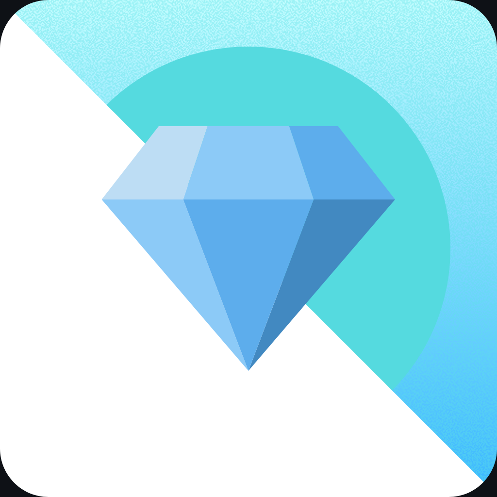
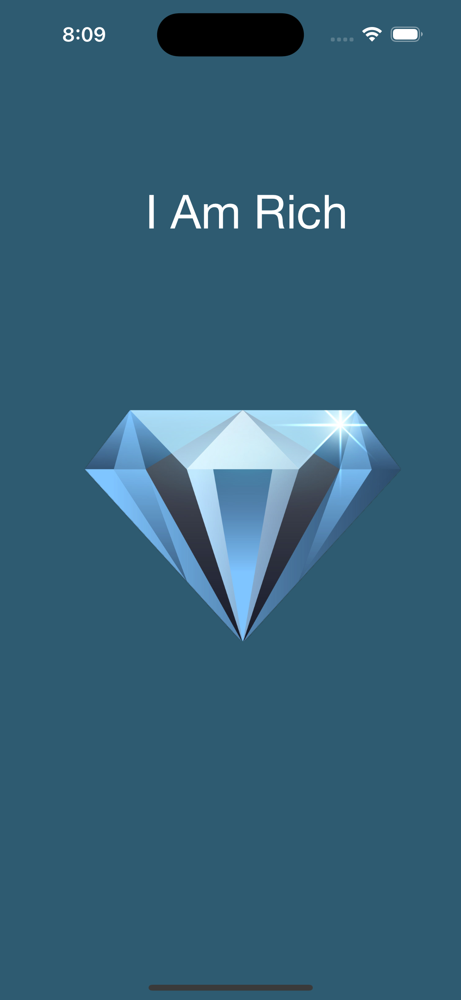

<section align="center">
  
  <h1>I Am Rich</h1>
  
<em>An Xcode Storyboard and Interface Builder Challenge.</em>

</section>

---

## Project Overview

This is a guided project based on Dr. Angela Yu's **Complete iOS App Development Bootcamp**. The objective of this challenge is to build an app using Xcode’s Storyboard and Interface Builder, focusing on UI design, screen constraints, and testing on both a simulator and a physical iPhone device.

## Concepts Learned

Throughout this project, I learned and implemented the following key concepts:

- Setting up a new iOS project from scratch in Xcode ✏️
- Navigating the Xcode interface and tools 💻
- Designing an app using iOS UI components within Interface Builder 🎨
- Integrating image assets into the app 🌃
- Creating and applying a custom app icon 📱
- Running and testing the app on both the iOS Simulator and a physical iPhone device 🤳

## How to Run

1. Clone the repository to your local machine.
2. Open the project in Xcode.
3. Run the app on a simulator or your connected iPhone device.